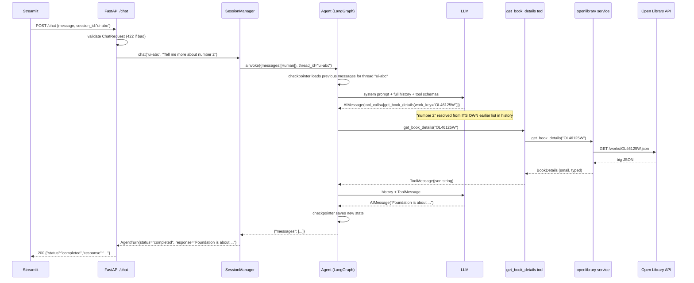

# 01 — Architecture & Folder Structure

## The one diagram to memorise

```
 Frontend (Streamlit / React)            <- knows only HTTP + JSON
        │  POST /chat  {message, session_id}
        ▼
 FastAPI  (backend/main.py, api/routes.py)   <- validates, routes, maps errors to HTTP codes
        │
        ▼
 SessionManager (backend/sessions/manager.py) <- session_id -> thread_id, handles interrupt/resume
        │
        ▼
 LangChain Agent (backend/agent.py)        <- LLM loop: think -> pick tool -> observe -> answer
        │
        ├── search_books ─┐
        ├── get_book_details ├── Tools (backend/tools/)   <- thin wrappers with LLM-facing docstrings
        ├── search_authors ─┤
        └── proceed_to_borrow (HITL) ┘
                │
                ▼
 Service layer (backend/services/openlibrary.py) <- HTTP calls, parsing, error translation
                │
                ▼
 External API (Open Library  /  Ticketmaster in your case)
```

Each layer only talks to the layer directly below it. That is the whole architecture.

## Why layers? (What goes wrong without them)

| Anti-pattern from the assignment's "What You Should NOT Do" | Layer that prevents it |
|---|---|
| `if "concert" in query: search_concerts()` | Agent layer — the LLM routes, not your code |
| One giant tool with the whole API inside | Tools layer — one job per tool, service does the HTTP |
| AI agent inside frontend code | FastAPI layer — the UI never imports LangChain |
| Dummy data | Service layer — real HTTP to the real API |
| Booking exposed without HITL | Session manager + HITL middleware |

## Folder structure, file by file

```
sample_project/
├── backend/
│   ├── main.py            App factory. Lifespan builds the agent ONCE. CORS. Exception handlers.
│   ├── config.py          `settings` object. The ONLY place that reads .env.
│   ├── agent.py           build_agent(): create_agent + system prompt + checkpointer + HITL.
│   ├── api/
│   │   └── routes.py      /chat /chat/stream(SSE) /approve /reject /health /sessions/{id} /books/{id}
│   ├── tools/
│   │   ├── __init__.py    READ_ONLY_TOOLS, ACTION_TOOLS, TOOLS_REQUIRING_APPROVAL
│   │   ├── _helpers.py    to_json(), error_payload()  -> tools never raise
│   │   ├── book_tools.py  search_books, search_books_by_subject, get_book_details
│   │   ├── author_tools.py search_authors, get_author_details
│   │   └── action_tools.py proceed_to_borrow   (needs approval)
│   ├── services/
│   │   ├── exceptions.py  ExternalAPIUnavailable, ResourceNotFound, InvalidQuery
│   │   └── openlibrary.py HTTP client + typed result models + parsing
│   ├── models/
│   │   └── schemas.py     Pydantic request/response models = the API contract
│   ├── prompts/
│   │   └── system_prompt.py build_system_prompt(today)
│   └── sessions/
│       └── manager.py     SessionManager: chat(), stream_chat(), approve(), reject(), history(), delete()
├── frontend/
│   └── streamlit_app.py   Chat UI + Approve/Reject card. Only uses `requests`.
├── tests/
│   ├── fake_llm.py        Scripted LLM -> test everything with zero API cost
│   ├── conftest.py        App factory fixture with patched service layer
│   ├── test_api_flow.py   The assignment's "Mandatory Test Scenario" as code
│   ├── test_bonus_features.py  SSE streaming + SQLite persistence across restarts
│   └── test_service_parsing.py
├── docs/                  You are here
├── .env.example           Every variable, documented
├── .gitignore             `.env` is in here. Always.
├── requirements.txt
└── README.md
```

This matches the assignment's *Suggested Project Structure* with two additions:
`sessions/` (keeps HITL orchestration out of routes) and `tests/`.

## A complete request, traced

User types **"Tell me more about number 2"** after a search.



Two things to notice:

1. Nowhere did *our* code look at the words "number 2". The LLM saw its own previous
   numbered list in the history (restored by the checkpointer) and resolved the reference.
2. The LLM saw a **small JSON**, not Open Library's raw payload. The service layer is where
   you protect your token budget and the model's accuracy.

## Exercise

Draw the same sequence diagram for **"I want to read it"** → Approve. Where does the flow
stop? Which HTTP request restarts it? Check your answer against doc 07.
